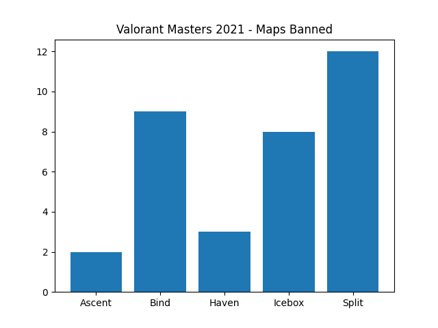

# Description 
This is just some data science work done on some data retrieved from the valorant masters stage 2 tournament.

# Questions Answered?

### **Who is the best player from each country in this tournament(Based on KDA)**
- The best Player from Canada is TenZ, with a KDA of 1.87
- The best Player from Belgium is    ScreaM, with a KDA of 1.77
- The best Player from United States is ShahZaM, with a KDA of 1.67     
- The best Player from  United Kingdom is Mistic, with a KDA of 1.74
- The best Player from Finland is  Jamppi, with a KDA of 1.43
- The best Player from South Korea is Lakia, with a KDA of 1.61
- The best Player from Thailand is   Patiphan, with a KDA of 1.5     
- The best Player from Japan is 17    Neth, with a KDA of 1.27
- The best Player from Czech Republic is Magnum, with a KDA of 1.43
- The best Player from Croatia is Doma, with a KDA of 1.52
- The best Player from Chile is Mazino, with a KDA of 1.55
- The best Player from Brazil is Sacy, with a KDA of 1.46
- The best Player from Argentina is Klaus, with a KDA of 1.49        

### **The average KDA of every single country**
- The Country Canada has an average of a 1.3 KDA
- The Country Belgium has an average of a 1.77 KDA
- The Country United States has an average of a 1.13 KDA
- The Country  United Kingdom has an average of a 1.13 KDA
- The Country Finland has an average of a 1.41 KDA
- The Country South Korea has an average of a 1.05 KDA
- The Country Thailand has an average of a 1.1 KDA
- The Country Japan has an average of a 0.92 KDA
- The Country Czech Republic has an average of a 1.43 KDA
- The Country Croatia has an average of a 1.52 KDA
- The Country Chile has an average of a 0.98 KDA
- The Country Brazil has an average of a 0.75 KDA

### **Data visualization to show the maps banned**

##### Source
https://liquipedia.net/valorant/VALORANT_Champions_Tour/2021/Stage_2/Masters/Statistics